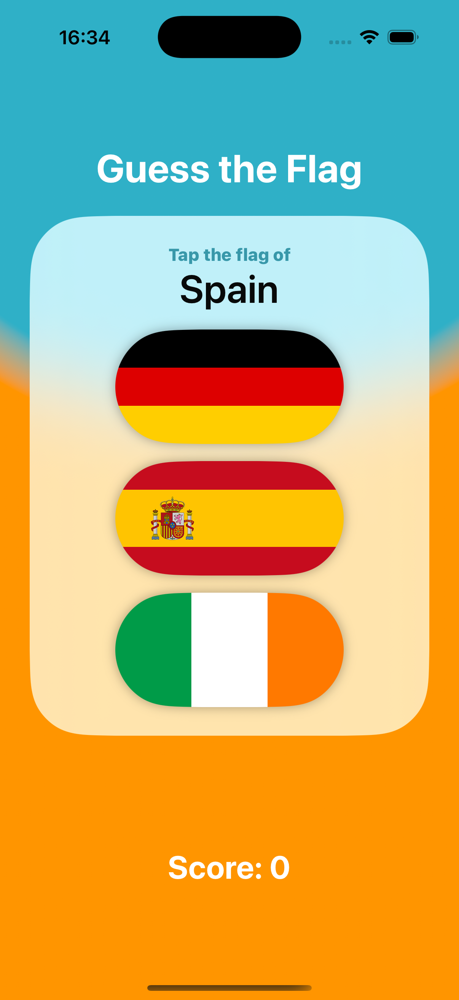
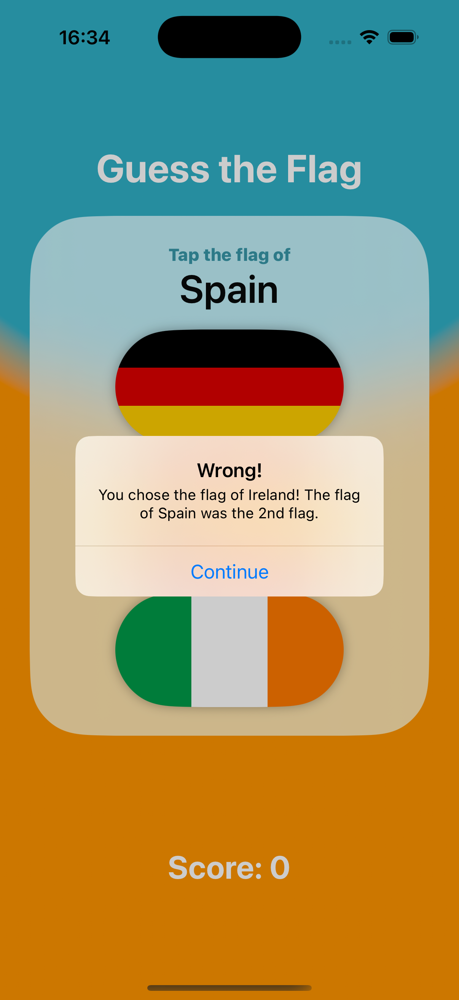
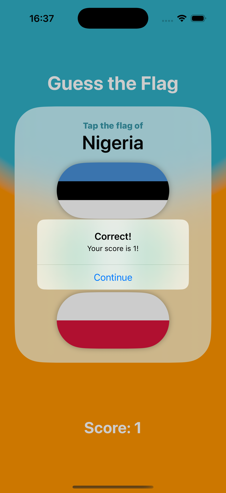
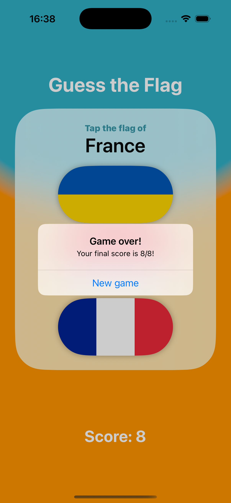

# Guess the Flag

**Guess the Flag** is a fun and educational flag-identification game built using SwiftUI. Created as part of the [100 Days of SwiftUI](https://www.hackingwithswift.com/100/swiftui) challenge, it tests players on their knowledge of world flags through a colorful and interactive quiz-style experience.

---

## Features

- Randomized selection from 12 world flags
- Tap-to-guess gameplay with immediate feedback
- Score tracking and final game summary after 8 rounds
- Beautiful gradient background and playful rounded UI
- Easy reset for replayability

---

## Screenshots

  
  

---

## License

This project is licensed under the [Creative Commons Attribution-NonCommercial 4.0 International License](https://creativecommons.org/licenses/by-nc/4.0/).

You may use and adapt this code for personal or educational purposes. Commercial use is prohibited without prior permission.
